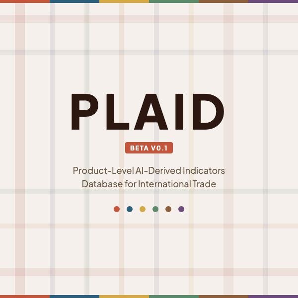

<p align="center">
  
</p>

# PLAID: Product-Level AI-Derived Indicators Database

LLM-based pipeline for generating, validating, and applying product-level trade indicators at the HS 6-digit level.

**Authors:** Carsten Brockhaus, [Julian Hinz](https://julianhinz.com), [Irene Iodice](https://ioire.github.io)

**Website:** [plaid.julianhinz.com](https://plaid.julianhinz.com) | **Mirror:** [trade.ifw-kiel.de/PLAID](https://trade.ifw-kiel.de/PLAID/) | **API:** [Documentation](https://plaid.julianhinz.com/llms-full.txt)

---

## What is PLAID?

Empirical research in international trade increasingly relies on product-level panel data, but the indicators used to characterize traded products have not kept pace. Classical measures like the Rauch (1999) classification were defined for older nomenclatures and have never been systematically updated. PLAID addresses this gap with a replicable pipeline in which large language models classify products at scale.

Each HS 6-digit product is independently classified by an ensemble of four frontier LLMs, and predictions are aggregated into majority-vote labels with transparent uncertainty measures. Six indicators are available across all seven HS revisions (H0–H6, 1988/92–2022):

| Indicator | Categories | Benchmark |
|-----------|-----------|-----------|
| **Rauch classification** | organized exchange / reference priced / differentiated | Rauch (1999) |
| **Broad Economic Categories** | capital / intermediate / consumption | UN BEC Rev. 5 |
| **Perishability** | 5-class scale (ultra-perishable to non-perishable) | — |
| **Hazardous materials** | boolean | GHS / IMDG / IATA-DGR |
| **Microchip content** | boolean | OECD ICT goods list |
| **3TG conflict minerals** | boolean + mineral type | EU 2017/821 |

## Get the data

If you just want the indicator files (no code needed):

- **Website:** Browse and download at [plaid.julianhinz.com](https://plaid.julianhinz.com/#download)
- **Mirror:** [trade.ifw-kiel.de/PLAID](https://trade.ifw-kiel.de/PLAID/)
- **API:** Query individual products at `https://plaid.julianhinz.com/api/v0.1/{revision}/{code}.json`

```r
# Example: load the Rauch classification for HS 1992
library(data.table)
rauch <- fread("https://plaid.julianhinz.com/data/PLAID_v0.1_rauch_H0.csv.gz")
```

Files are CSV (gzipped), one per indicator × HS revision. All files include the HS 6-digit code, product description, majority-vote classification, and per-category vote shares for uncertainty quantification.

## Replicate the pipeline

### Prerequisites

- **R** (≥ 4.3) — packages are installed automatically via `pacman`
- **Python** (only for HS explanatory notes scraper)
- **[OpenRouter API key](https://openrouter.ai/)** set as `OPENROUTER_API_KEY` environment variable (only if re-running LLM classifications)

### External data

The following files are freely available but too large to include in the repository. Download them manually and place in the indicated directories.

| File | Size | Source | Place in |
|------|------|--------|----------|
| CEPII Gravity V202211 | ~200 MB | [cepii.fr/gravity](https://www.cepii.fr/CEPII/en/bdd_modele/bdd_modele_item.asp?id=8) | `input/gravity/` |
| HS92 bilateral trade | ~3 GB | [atlas.cid.harvard.edu](https://atlas.cid.harvard.edu/about-data) | `input/trade_data/HS92/` |
| SITC bilateral trade | ~2 GB | [atlas.cid.harvard.edu](https://atlas.cid.harvard.edu/about-data) | `input/trade_data/SITC/` |
| HS nomenclature | ~5 MB | [UN STATS](https://unstats.un.org/unsd/classifications/Econ) | `input/product_descriptions/` |
| HS concordances | ~1 MB | [WITS](https://wits.worldbank.org/product_concordance.html) | `input/concordance/` |

### Run the pipeline

```bash
export OPENROUTER_API_KEY="your-key-here"

# Full pipeline: all 6 indicators across H0–H6 with cross-revision deduplication
make plaid MODELS="mistralai/mistral-small-2603 google/gemini-2.5-flash"

# Individual indicator pipelines
./code/create_hs_rauch/run_hs_rauch.sh MODEL [HS_VER]
./code/create_hs_perishability/run_hs_perishability.sh MODEL [HS_VER]
./code/create_hs_bec/run_hs_bec.sh MODEL [HS_VER]
./code/create_hs_hazmat/run_hs_hazmat.sh MODEL [HS_VER]
./code/create_hs_microchip/run_hs_microchip.sh MODEL [HS_VER]
./code/create_hs_3tg/run_hs_3tg.sh MODEL [HS_VER]

# SITC Rauch replication
./code/recreate_rauch_1995/run_and_compare_two_models.sh

# Assemble indicator database
Rscript code/build_database.R

# Cross-model consistency checks
make consistency
```

### Reproduce paper tables and figures

The gravity replication and uncertainty analysis require the external data files listed above.

```bash
# Rauch gravity replication (Table 3 in the technical paper)
Rscript code/09_rauch_replication_table.R

# Uncertainty screen figure (Figure 3)
Rscript code/09_rauch_uncertainty_figure.R

# Per-indicator gravity analysis
Rscript code/create_hs_rauch/07_analysis.R
Rscript code/create_hs_perishability/07_analysis.R
```

## Project structure

```text
code/
├── common/                        # Shared pipeline (LLM caller, dedup, fan-out)
├── create_hs_rauch/               # Rauch classification (w/r/n)
├── recreate_rauch_1995/           # SITC-based Rauch replication
├── create_hs_perishability/       # Perishability (5-class scale)
├── create_hs_bec/                 # BEC end-use categories
├── create_hs_hazmat/              # Hazardous materials
├── create_hs_microchip/           # Microchip/semiconductor content
├── create_hs_3tg/                 # 3TG conflict minerals
├── 09_rauch_replication_table.R   # Gravity replication (paper Table 3)
├── 09_rauch_uncertainty_figure.R  # Uncertainty screen (paper Figure 3)
├── build_database.R               # Assemble indicator database
└── 99_consistency_checks.R        # Cross-model agreement analysis

input/
└── benchmarks/                    # Validation benchmarks (BEC, ICT, EU 3TG)

makefile                           # Pipeline orchestration
```

## Contribute

We welcome contributions in two forms:

### Suggest a correction

If you believe a product is misclassified, please let us know:
- **Email:** [tradepolicy@kielinstitut.de](mailto:tradepolicy@kielinstitut.de)
- **GitHub:** [Open an issue](https://github.com/julianhinz/PLAID/issues/new?labels=correction&title=Correction:+HS+CODE)

### Suggest an indicator

PLAID is designed to grow. If you need a product-level attribute that is not yet covered:
- **Email:** [tradepolicy@kielinstitut.de](mailto:tradepolicy@kielinstitut.de)
- **GitHub:** [Open an issue](https://github.com/julianhinz/PLAID/issues/new?labels=indicator-suggestion&title=Indicator+suggestion:+)

## Citation

```bibtex
@unpublished{BrockhausHinzIodice2026,
  author = {Brockhaus, Carsten and Hinz, Julian and Iodice, Irene},
  title  = {{PLAID}: Product-Level {AI}-Derived Indicators Database
            for International Trade},
  year   = {2026},
  note   = {Working paper}
}
```

## License

Data: [CC BY 4.0](https://creativecommons.org/licenses/by/4.0/). Code: MIT.
